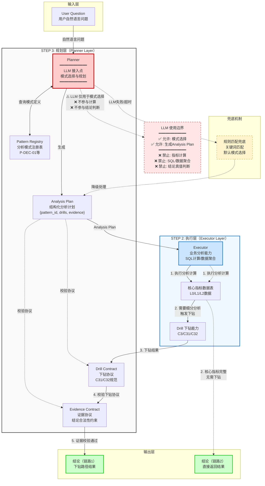

# STEP 3（含 LLM）工程架构图

## 架构图

## 架构说明

### 1. STEP 3 的职责是什么？

**STEP 3 是分析模式化与规划层**，核心职责包括：

1. **模式选择**：从用户自然语言问题中识别并选择最合适的分析模式（如 P-DEC-01 决策双诊断模式）
2. **分析规划**：生成结构化的 `Analysis Plan`，明确指定：
   - 使用的 `pattern_id`
   - 需要执行的下钻路径（如 C3 → C31/C32）
   - 证据依赖关系
3. **协议管理**：维护 `Pattern Registry`、`Drill Contract`、`Evidence Contract` 等协议，确保分析流程的标准化和可验证性
4. **规划输出**：将规划结果传递给 STEP 2（Executor）执行，但不参与实际的数据计算和结论判断

**关键原则**：STEP 3 负责"选择做什么分析"，STEP 2 负责"执行分析计算"。

### 2. LLM 在哪里接入、为什么在这里？

**LLM 接入点：Planner 组件**

**为什么在 Planner 接入：**

1. **自然语言理解需求**：用户输入是自然语言问题（如"为什么当前周期转化率下降了？"），需要理解问题意图并映射到结构化分析模式
2. **模式匹配复杂性**：随着模式库扩展（P-DEC-01、P-ACQ-01、P-RET-01 等），规则匹配难以覆盖所有场景，LLM 可以处理语义相似性
3. **隔离计算风险**：将 LLM 限制在 Planner 层，确保：
   - **计算层（Executor）**：使用确定性 SQL 查询和业务逻辑，保证结果可验证
   - **判断层（Evidence Contract）**：基于结构化证据进行规则校验，不依赖 LLM 的不可控输出
4. **可控性**：LLM 只输出结构化的 `Analysis Plan`（包含 `pattern_id`、`drill_requirements` 等），不直接生成结论或计算结果

**LLM 使用边界**：
- ✅ **允许**：从自然语言选择分析模式、生成结构化分析计划
- ❌ **禁止**：指标计算、SQL/数据聚合、结论真值判断

### 3. LLM 失败时系统如何兜底？

**多层兜底机制：**

1. **规则匹配兜底**：
   - 当 LLM 调用失败或超时时，Planner 降级为基于关键词的规则匹配
   - 例如：问题包含"转化率"+"下降" → 匹配到 P-DEC-01 模式
   - 维护关键词到 `pattern_id` 的映射表

2. **默认模式选择**：
   - 如果规则匹配也无法确定，系统选择默认模式（如 P-DEC-01）
   - 或返回"无法识别问题类型，请使用建议问题"的提示

3. **超时与重试**：
   - LLM 调用设置超时阈值（如 3 秒）
   - 超时后立即切换到规则匹配，不阻塞用户请求

4. **错误处理**：
   - LLM 返回的 `Analysis Plan` 必须通过 `Pattern Registry` 校验
   - 如果 `pattern_id` 不存在或格式错误，自动降级为规则匹配

5. **用户体验**：
   - 兜底机制对用户透明，系统仍能正常返回分析结果
   - 在日志中记录 LLM 失败事件，用于后续优化

**设计原则**：系统必须保证在 LLM 完全不可用的情况下，仍能通过规则匹配提供基础分析能力。

---

## 数据流说明

### Analysis Plan 流向

1. **User Question** → **Planner**：用户输入自然语言问题
2. **Planner** → **Pattern Registry**：查询可用分析模式
3. **Planner** → **Analysis Plan**：生成结构化分析计划（包含 `pattern_id`、`drill_requirements`、`evidence_requirements`）
4. **Analysis Plan** → **Executor（STEP 2）**：执行层根据计划执行分析计算
5. **Executor** → **核心指标数据表**：查询/计算数据
6. **数据表** → **结论**（链路2：直接返回）或 **Drill** → **Drill Contract** → **Evidence Contract** → **结论**（链路1：下钻路径）

### 两条链路说明

**链路1（需要下钻）** - 图中实线箭头路径：
- **适用场景**：需要细分分析的问题（如"决策阶段为什么失效"、"转化率下降的具体原因"）
- **判断条件**：核心指标数据表的数据不足以直接回答，需要进一步下钻细分
- **执行流程**：
  1. Analysis Plan → Executor 执行分析计算
  2. Executor → 核心指标数据表查询数据
  3. 数据表判断需要细分 → 触发 Drill 下钻（C3/C31/C32）
  4. Drill 结果 → Drill Contract 校验下钻协议
  5. Drill Contract → Evidence Contract 校验证据完整性
  6. Evidence Contract → 输出结论（链路1）

**链路2（直接返回）** - 图中虚线箭头路径：
- **适用场景**：核心指标数据表已包含完整答案的问题（如"当前周期转化率是多少"、"上周期和当前周期的转化率对比"）
- **判断条件**：核心指标数据表的数据已足够直接回答用户问题，无需下钻
- **执行流程**：
  1. Analysis Plan → Executor 执行分析计算
  2. Executor → 核心指标数据表查询数据
  3. 数据表判断数据完整 → 直接输出结论（链路2），跳过 Drill 流程

**关键区别**：
- 链路1 需要经过 Drill → Drill Contract → Evidence Contract 的完整校验流程
- 链路2 直接从核心指标数据表返回结论，不经过下钻和协议校验
